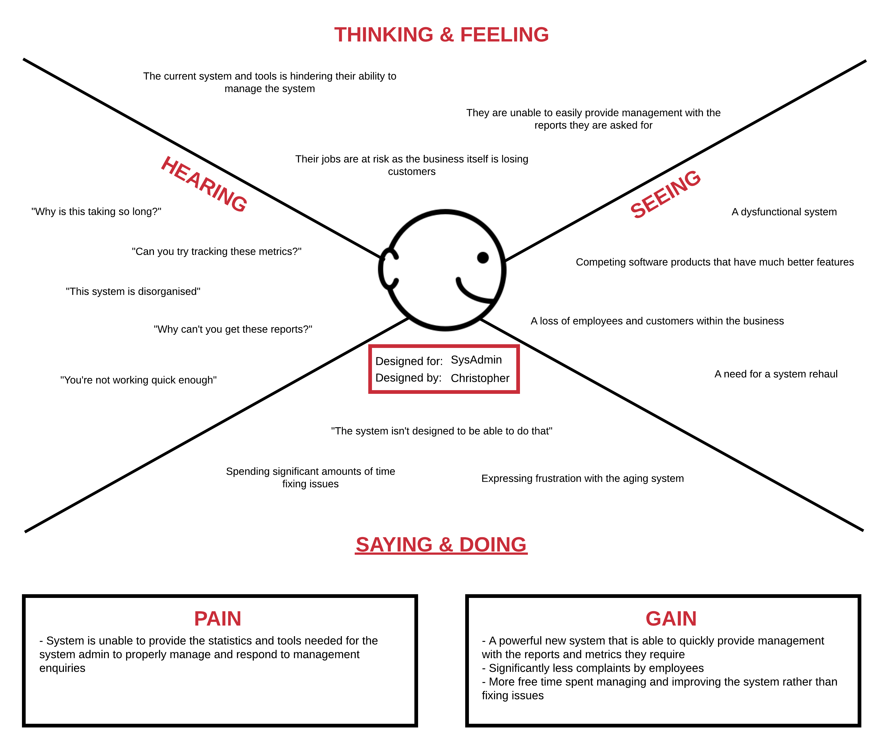
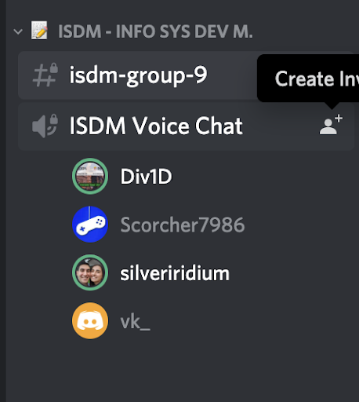

# Travel Company - New CMC System Report

**Report compiled by**

|||
---:|:---
`13561232`|Sarah Assaf
`13565647`|Daniel Heffernan
`13532787`|Christopher Kesoglou
`13584127`|Vishaal Kumar

---

## Table of Contents

1. Problem Definition  
   1.1 [Objectives](#1.1-Objectives)  
   1.2 [Assumptions](#1.2-Assumptions)  
   1.3 [List of Stakeholders](#1.3-List-of-Stakeholders)  
   1.4 [Empathy Maps](#1.4-Empathy-Maps)  
   1.5 [POV Statements](#1.5-POV-Statements)

2. Ideation  
   2.1 [Reflections](#2.1-Reflections)  
   2.2 [How Might We Statements](#2.2-How-Might-We-Statements)  
   2.3 [Brainstorm](#2.3-Brainstorm)  
   2.4 [Vote](#2.4-Vote)  
   2.5 [Backlog](#2.5-Backlog)

3. Prototyping and Modelling  
   3.1 [User Stories](#3.1-User-Stories)  
   3.2 [Use Case Diagram](#3.2-Use-Case-Diagram)  
   3.3 [Activity Diagrams](#3.3-Activity-Diagrams)  
   3.4 [Class Diagram](#3.4-Class-Diagram)  
   3.5 [Collaboration Diagrams](#3.5-Collaboration-Diagrams)

4. Competitive Advantage  
   4.1 [Competitive Advantage](#4.1-Competitive-Advantage)  
   4.2 [Impact of Failure](#4.2-Impact-of-Failure)  

5. Agile Methodology  
   5.1 [Scrum Activities Used](#5.1-Scrum-Activities-Used)  
   5.2 [Explanation and Evidence](#5.2-Explanation-and-Evidence)

---

## Section 1: Problem Definition

###  1.1 Objectives
[back to top](#Table-of-Contents)

This report seeks to develop a Call Management Centre (CMC) through the Design Thinking process in response to the issues brought up 
by the major Travel Company. This process utilises the designer’s sensibility to help develop a creative and groundbreaking yet 
technologically feasible product that the client can use to take business strategy and convert it into customer value and 
competitive advantage within the market. This report will go through the steps of the design thinking process to ensure the brief is 
approached systematically but without the rigidity of common software development processes.

The main objectives of this report is to: 

1. To create an innovative yet technologically feasible Call Management Centre product 

2. To create a product that will embody the desires of all stakeholders involved within the upgrade of the Call Management Centre

3. Develop many features that are desired by the client so they are able to have many options to choose from

4. To develop comprehensive diagrams for the client so they are able to understand the flow of data and methods

5. To show the client the competitive advantage they may achieve as a result of the developed product and to warn them of potential impacts of failure

6. To develop the product using an Agile process

###  1.2 Assumptions
[back to top](#Table-of-Contents)

Several assumptions have been made about the given brief to help clarify and justify the reasoning behind our creative decisions as well as about certain diagrams.

These assumptions are as follows: 
    
1. Competing travel companies have a more advanced CMC than the travel company’s 

2. The current CMC is causing customer dissatisfaction 

3. The current CMC is causing a loss of sales 

4. The current CMC is difficult and inefficient to use and as such, the travel company is losing employees 

5. The travel company management expects for RMs to learn more about the product offering which is outside their specialised knowledge

6. The holiday packages offered by  the Travel Company are only forms of holidays that involve airlines only.

7. Airline companies form partnerships with the Travel Company when promoting holiday packages. 

8. Relationship Managers receive a commission based income based on the number of holiday packages they sell. 

9. There is a higher staff turnover at the Travel Company.

10. Developers and System Admin are two different entities and are treated as such throughout the body of this report.

### 1.3 List of Stakeholders 
[back to top](#Table-of-Contents)

  - Travel Company 
  - Customers
  - Relationship Managers (RMs)
  - Developers and managers (us) 
  - Airline company
  - System Admin

### 1.4 Empathy Maps
[back to top](#Table-of-Contents)
  
**
Travel Company
**

**
Customers
**

**
Relationship Managers (RMs)
**

**
Developers
**

**
Airline Company
**

**
System Admin
**

  
### 1.5 POV Statements
[back to top](#Table-of-Contents)
  
**TRAVEL COMPANY**

- USER  
  Travel Company that is providing travel packages to consumers

- NEED  
  Call management centre to be improved to help improve their business

- INSIGHT  
  Current system is outdated and is losing both customers and employees for the company 
   
**Customers**
   
- USER  
  Customers (existing and potential) for the Travel Company that is providing travel packages and telemarketing

- NEED  
  Travel Company’s to understand their needs and be a convenient option

- INSIGHT  
  The Travel Company seems disorganised and it doesn’t feel like they understand me

**Relationship Managers**
   
- USER  
  Relationship Managers of the travel company

- NEED  
  To be able to respond to customer requests at all times and make a high level of holiday package sales 

- INSIGHT  
  The current CMC system directs customers to Relationship Managers who are unable to respond to their request which creates unhappy customers and a loss of sales. 
   
**DEVELOPERS**
  
- USER  
  Developers that are working on the CMC system for the Travel Company

- NEED  
  Time and resources to develop the CMC for the Travel Company

- INSIGHT  
  Developers need a relaxing, low-stress environment with ample time for them to think clearly so that they are able to develop a system to the best of their abilities.
   
**Airline Companies**
   
- USER  
  Airline Company that is providing modes of transportation to customers

- NEED  
  To get customers to their desired location in a quick and comfortable manner

- INSIGHT  
  Current operation isn’t profitable enough 
   
**System Administrators**

- USER  
  System Administrators working for the Travel Company, managing it’s systems and responding to management enquiries about their digital workflow

- NEED  
  For the internal system to provide an extensive set of tools to enable them to do their jobs.

- INSIGHT  
  The current internal system is dated, doesn’t provide any metric tracking features needed, and required constant maintenance

--- 

## Section 2: Ideation

### 2.1 Reflections
[back to top](#Table-of-Contents)
  
Several assumptions were made about the given brief and will be fleshed out through the body of this reflection. The broadest assumption that was made was that the Travel Company’s current Call Management Centre (CMC) was a detriment to all aspects of the business. The current CMC does not compare to other travel company CMC’s and this technological hindrance means that other companies have the competitive advantage. Further, it is assumed that the current CMC is causing dissatisfaction with customers as it is too hard to reach an appropriate RM and the packages are hard to understand. This dissatisfaction means that customers turn to other travel companies for a better customer service experience resulting in loss of business and revenue.

It is also assumed that the current CMC is difficult for RMs to work with, making it too difficult to reach customers and making the job they work frustrating. 
This goes further to assume that the travel company expects that RMs thoroughly learn and understand the product offering despite it being outside their specialised knowledge. The current convoluted CMC system makes learning this information difficult and makes reaching customers harder. Since RMs work on commission, this difficulty to receive customers means that employees will not want to stay at the company. These all compound to result in a loss of employees within the company meaning there are less RMs to serve customers. Finally, it is assumed that airline companies work with the travel company to promote 
holiday packages and holiday deals. 

### 2.2 How Might We Statements
[back to top](#Table-of-Contents)
  
**Travel Company**

_We met..._ the management of the Travel Company that has asked us to develop and manage the new CMC.

_We were surprised to notice..._ that the company was beginning to decline since there weren’t enough customers doing business with them, meaning the employees had no work and were leaving. 

_We wonder if this means..._ if the Travel Company will go bankrupt if the CMC system is not fixed

_It would be game changing to..._ drastically improve the CMC so that the company can lift itself off the ground again.

> How might we develop a high quality, technologically advanced CMC in a short timeline to ensure that more customers and employees do not leave the company, thus revitalising the business? 
  
**Customers**

_We met..._ with some of the potential and existing customers of the Travel Company that were contacted by phone.
   
_We were surprised to notice..._ that many felt that their personal needs were not being understood.
   
_We wonder if this means..._ our current process of personalising our recommendations is falling short of expectations.

_It would be gamechanging to..._ develop an automated system where the existing data we collect can be used to generate better matched recommendations for travel and accommodation.

> How might we might data with a new and imporved CMC to deliver fast, accurate and personalised recommendations for our customers.
  
**Relationship Managers**

_We met..._ the Relationship Managers employed at the Travel Company
    
_We were surprised to notice..._ the dissatisfaction felt from the Relationship Managers due to angry customers, low sales, low commission and high expectations from management.
 
_We wonder if this means..._ the current CMC system is causing this dissatisfaction. 

_It would be gamechanging to..._ improve the CMC system of the Travel Company to ensure that RMs are able to make sales to happy customers and feel satisfied. 

> How might we be able improve the CMC so that RMs are able to fully utilise their expertise to create sales.
  
**Developers**

_We met..._ the developers put in charge of creating and updating the current CMC.

_We were surprised to notice..._ that they were feeling nervous and pressured since a lot of the company’s success is being put onto the CMC and the success of its development. 

_We wonder if this means..._ if the developers may feel too anxious to perform to the best of their ability.

_It would be game changing to..._ encourage the developers to feel relaxed by giving them a fair timeline as well as a many meetings to ensure they are able to talk about issues they are experiencing and progress that have had.

> How might we ensure the developers are performing to the best of their ability whilst embodying all the desired features of the travel company? 
  
**Airline Companies**

_We met..._ the representatives from airline companies that have a partnership with the Travel Company. 

_We were surprised to notice..._ the low sales from the Travel Company meant that that Airline Companies were not maximising their profits.
 
_We wonder if this means..._ that the airline companies will reconsider their alliances with the Travel Companies if the travel company’s sales are consistently low. 

_It would be game changing to..._ improve the CMC system of the Travel Company to ensure that sales are high. 

> How might we be able to improve the reputation and increase the sales for the travel company in order to ensure high profits for Airline Companies. 
  
**System Administrators**
  
_We met..._ with the system administrators of the Travel Company.
   
_We were surprised to notice..._ that many saw the current system and its toolset to be lacking in sophistication to respond to management enquiries.
   
_We wonder if this means..._ significant valuable time is wasted by system administrators that could be better spent maintaining the system.

_It would be gamechanging to..._ develop a new toolset alongside an improved system where these complex queries can be performed with ease.

> How might we utilise database queries and a new intuitive UI within the CMC to build a powerful toolkit for system administrations.
   
### 2.3 Brainstorm
[back to top](#Table-of-Contents)

 
### 2.4 Vote
[back to top](#Table-of-Contents)
  
**Most Likely To Succeed:**

Inbound callers interested in the Travel Company’s holiday packages will be first met with an automated phone calling system where they will use their phone keypad to input their travel destination and holiday type. This will be used to direct the outbound caller to the most appropriate RM. 

We think this idea is the most practical and will provide the company the best opportunity to revitalise their business and 
system.

**Most Likely To Delight:**

Whilst a customer is on hold, the “hold music” is a recording of an employee discussing the featured holiday packages for the month meaning the customer is getting information as they wait rather than listening to annoying hold music.

Hold music often gets annoying for customers so we decided that this idea is the most “likely to delight” because it will replace 
the fuzzy music with informative holiday packages instead to help inform their decisions.

**Most breakthrough:**

Relationship Managers could be specialised in certain countries and continents so that when a customer calls, they can be connected with an RM who knows extensively about that continent and has been trained by the travel company.

This idea is the most breakthrough because it would stop RMs having to learn every single package and deal within the company. This would save a lot of money on training and it would give RMs the opportunity to truly understand the area of expertise which will help them provide excellent customer service.

### 2.5 Backlog
[back to top](#Table-of-Contents)
  
See the [Github Issues](https://github.com/vkumar12180/ISDM-Group-2/issues?q=is%3Aissue) from this repository.

---

## Section 3: Modelling 

### 3.1 User Stories
[back to top](#Table-of-Contents)
  
**Travel Company**

_AS A..._ Travel Company  
_I WANT..._ My employees to be thoroughly trained  
_SO THAT..._ They are able to provide the best service to the business’ customers

_AS A..._ Travel Company  
_I WANT..._ A new Call Management Centre system  
_SO THAT..._ We are able to revitalise our business by impressing customers and aiding employees

_AS A..._ Travel Company  
_I WANT..._ To have competitive prices on holiday packages within the market  
_SO THAT..._ We are able to draw in customers to purchase packages from us  

_AS A..._ Travel Company  
_I WANT..._ To bring in new customers and more business  
_SO THAT..._ We are able to benefit our company as well as the airlines and cruise companies who work with us

**Customer**

_AS A..._ Customer  
_I WANT..._ To have my details and situation saved  
_SO THAT..._ I only need to explain it once and don't have to go through it again with every call

_AS A..._ Customer  
_I WANT..._ To have travel and accomodation recommendations matched to my needs  
_SO THAT..._ I receive only relevant suggestions and can organise my holiday efficiently

_AS A..._ Customer  
_I WANT..._ My call to be routed and answered quickly  
_SO THAT..._ I'm not wasting a lot of time waiting on hold
  
_AS A..._ Customer  
_I WANT..._ To be able to organise a call back time  
_SO THAT..._ I can fit this recommendation and booking process to my schedule 

**Relationship Manager**

_AS A..._ Relationship Manager   
_I WANT..._ Customers who are interested in holiday packages that I have knowledge and expertise on  
_SO THAT..._ I am able to cater to their request and generate a holiday package sale

_AS A..._ Relationship Manager   
_I WANT..._ To be able to cold call prospects interested in holiday packages that I have knowledge and expertise on  
_SO THAT..._ My time is not wasted cold calling uninterested prospects and maximising my chances of making a sale.

_AS A..._ Relationship Manager  
_I WANT..._ Access to a customer’s age, gender, ethnicity and travel related interests  
_SO THAT..._ I have information of a customer to ensure I am able to provide high levels of customer service. 

**Developer**

_AS A..._ Developer  
_I WANT..._ To develop a Call Management Centre for the Travel Company since this is the task we’d be hired for  
_SO THAT..._ We are able to get paid and move onto new jobs. 

_AS A..._ Developer  
_I WANT..._ A comfortable environment to work without the pressures of a strict timeline or unreasonable managers  
_SO THAT..._ We are not too stressed and are able to do the best work we can given the project brief and specifications. 

_AS A..._ Developer  
_I WANT..._ Early notification of any changes to the specifications such as new features or changes to original features  
_SO THAT..._ We are able to change the product as early as possible without interfering with future code. 
  
**Airline Company**

_AS AN..._ Airline company  
_I WANT..._ More customers coming from the travel company  
_SO THAT..._ We can increase our total profit

_AS AN..._ Airline company  
_I WANT..._ Customers to have a good experience with the CMC  
_SO THAT..._ They have an overall better experience travelling with us increasing company reputation

_AS AN..._ Airline company  
_I WANT..._ The holiday package lines to be full  
_SO THAT..._ Space is not wasted in the airport

_AS AN..._ Airline company  
_I WANT..._ The holiday packages to be regularly used  
_SO THAT..._ Staff is not wasted waiting on non-existent customers
  
**System Administrator**

_AS A..._ System Administrator  
_I WANT..._ To have a visual dashboard with the current state of the system  
_SO THAT..._ I can easily monitor the system for active issues or outages
  
_AS A..._ System Administrator  
_I WANT..._ To be able to perform common queries from a control panel  
_SO THAT..._ I can save time when responding to management requests

_AS A..._ System Administrator  
_I WANT..._ To have powerful report exporting tools built in the system  
_SO THAT..._ I'm not wasting time producing graphs for management
  
_AS A..._ System Administrator  
_I WANT..._ To have tools to manage system data (including customers and staff) in bulk  
_SO THAT..._ I can effectively and efficiently maintain the system

### 3.2 Use Case Diagram
[back to top](#Table-of-Contents)

### 3.3 Activity Diagrams
[back to top](#Table-of-Contents)

  
### 3.4 Class Diagram
[back to top](#Table-of-Contents)

### 3.5 Collaboration Diagrams
[back to top](#Table-of-Contents)

  
--- 

## Section 4: Competitive Advantage

### 4.1 Competitive Advantage
[back to top](#Table-of-Contents)
  
The new and improved CMC will bring many benefits to the Travel Company which will bring them competitive advantage over other companies within the market. This technologically advanced system will save both the company and customers time. By rating customers, creating a customer profile based on predefined criteria and by specially training RMs by country in their knowledge of holiday packages, the process of matching a customer with an appropriate RM becomes extremely easy. This algorithmic match will mean that the customer experiences the best possible service for their desired needs without having to be put on hold for extensive periods of time and allows employees to serve many more customers within a working day.

By having to spend less time switching across RMs and putting customers on hold, the travel company will reduce call costs. By matching customers with an appropriate RM, customers will feel as though they are receiving a personalised and educated view of the available holiday packages, putting trust into the company and thus retaining and gaining more customers. Customers will prefer to stay with the travel company as a result of their customer service and matching system rather than going to another travel company. By training employees and gaining more customers, employees will feel as though they are being kept busy with their work and are serving more customers, meaning high commission thus encouraging employees to stay on with the travel company rather than moving. This profiling of customers to help match customers with an RM within the new CMC clearly will give the Travel Company competitive advantage over other companies within the market.

### 4.2 Impact of Failure
[back to top](#Table-of-Contents)
  
The development of this updated CMC is crucial to the success of this major Travel Company. The impact of failure within this project will have massive repercussions on the company as well as all of its employees. Should the development of the new CMC fail, the Travel Company will continue to lose customers with the confusing current system. Since it is currently difficult for customers to access RMs and as such, difficult for them to discuss holiday options, customers will turn to other companies at an increasing rate. Losing so many customers will mean that RMs interact with less companies. Since RMs work on commission, they will begin to make less money and have much less to do at work. This will result in many employees leaving the travel company to instead search for bigger and better career opportunities in other companies.

By losing employees and customers, the relationships the travel company had built with the airlines will be voided as the airlines will not be receiving any customers or revenue. This would mean that the airline is forced to instead form a relationship with a company that brings them business and will end the professional relationship with the Travel Company. Should the development of the CMC fail, the Travel Company will ultimately be forced to shut down since it will lose customers, employees and important professional relationships.

--- 

## Section 5: Agile Methodology

### 5.1 Scrum Activities Used and Evidence
[back to top](#Table-of-Contents)

Agile refers to a software development methodology in which the requirements elicitation and the development of those requirements progress in iterations and in smaller cross functional teams. Scrum is a form of agile methodology which introduces certain roles, artefacts and events. The most important part of scrum is the idea of sprints which is a fixed period (usually 14-30 days) to develop an iteration of the development. Each scrum team involves a product owner who is an individual that represents the end user and prioritises features, a scrum master that facilitates and manages the development and relationship between the product owner and development team and the development team which builds an increment of the product. Each scrum team involves events such as sprint planning which involves planning the amount of the backlog which will be developed for each iteration, the sprint review session which involves the product owner and development team reviewing the build that was conducted in that sprint, the daily scrum which involves status updates from the development team daily and the sprint retrospective which involves reviewing the sprint and identifying what was done right and what was done wrong. The scrum artefacts involve the product backlog which is a list of user stories that will be needed to develop the product and the sprint backlog specifies the list of user stories which will be developed in the sprint.

The group utilised the roles of product owner and scrum master. Firstly, the group members acted as product owners through the design thinking stage of the assignment. Each of us identified our stakeholders, created empathy maps and point of view statements for our stakeholder. Through creating empathy maps, we were able to understand our stakeholders and prioritise the features that should be part of the product which would maximise the value for the end user. From the point of view statements, we were able to understand the limitations of the current product which were not providing value and created a negative outlook to the stakeholder’s perception of the product and hence gave us a clearer view on what should be developed, giving us an indication on the skills of stakeholder management and prioritisation roles that a product owner would undertake. The role of scrum master was also carried out through the use of the tools on GitHub. A typical role of a scrum master would be to manage the backlog, plan and break down the work to maximise efficiency. The group undertook this role through the use of creating Issues on Github as shown in Figure 1. 

_Figure 1 - Evidence of issues_ (see also: [backlog](#2.5-Backlog))

Each issue created was labelled with the corresponding section of the assignment that the issue was related to and assigned to each person. Each issue in the issue backlog was assigned to each team member fairly and each group member would also comment on other issues that were not assigned to them to check for a status update as shown in Figure 2. 

_Figure 2 - Evidence of Comments_

Furthermore, through this issue backlog, we were able to conduct sprint planning. The group did utilise this event through coming up with issues in the issue backlog as shown in Figure 1 which identified what should be worked on for the project. Whilst the group did not meet daily due to COVID-19 restrictions, a scrum stand up was undertook each week in the tutorial sessions in where we talked about what we achieved in the issue backlog and which issues can be closed using Discord, what we will be working on next and whether there were any call-outs or problems on the work assigned. Our Discord call evidence is highlighted in Figure 3.

_Figure 3 - Evidence of Discussion_

